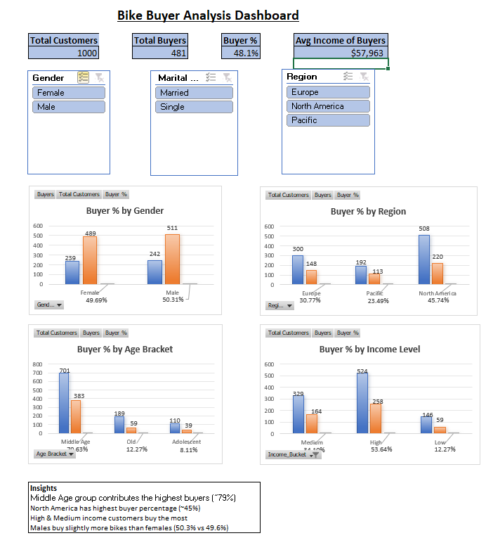

# 🚴 Bike Buyer Analysis Dashboard

## 🚀 Project Overview

Many bike retailers struggle to answer a simple but critical business question:

> **Who are our real customers, and which groups are most likely to buy bikes?**

Without this clarity, marketing budgets get wasted, sales strategies become guesswork, and growth slows down.

This project solves that problem by analyzing customer data and presenting **clear, actionable insights** through an **interactive Excel dashboard** designed for **business users, not technical teams**.

---

## 🔗 Project Links

- 🌐 **Live Portfolio Website:** https://auronex-portfolio.vercel.app  
- 📁 **GitHub Repository:** https://github.com/axaymathukiya27-tech/Bike_Buyer_Analysis

---

## 🎯 Business Objective

The goal of this project is to help a bike-selling business:

- Identify **high-potential customer segments**
- Improve **conversion rates**
- Optimize **marketing spend**
- Make **data-driven sales decisions**

---

## 🧠 How This Project Solves the Problem

I analyzed customer demographics and purchasing behavior, then transformed the data into a **simple visual dashboard** that answers key business questions like:

- Who buys bikes the most?
- Which regions generate higher sales?
- Does income level influence buying decisions?
- Which age group should marketing focus on?
- How do gender, occupation, and education affect purchases?

All insights are presented visually so **non-technical stakeholders can understand them instantly**.

---

## 📊 Dashboard Preview

### 📌 Main Business Dashboard


---

## 📈 What the Dashboard Shows

### 🔹 Key Performance Indicators (KPIs)
- Total Customers
- Total Buyers
- Buyer Percentage
- Average Income of Buyers

These KPIs give a **quick business health check** at a glance.

---

### 🔹 Customer Segmentation Analysis

The dashboard breaks down buyers by:

- **Gender**
- **Age Bracket**
- **Region**
- **Income Level**
- **Education**
- **Occupation**
- **Marital Status**

Each segment clearly shows:
- Total customers
- Number of buyers
- Buyer percentage

---

### 🔹 Interactive Filters (Slicers)

Users can filter insights by:
- Gender
- Marital Status
- Region

This allows business teams to:
- Compare customer groups
- Identify profitable segments
- Make focused marketing decisions

---

## 💡 Key Business Insights

✔ **Middle-aged customers** buy the most bikes (~79%)  
✔ **North America** has the highest buyer conversion (~45%)  
✔ **High & medium income groups** are top customers  
✔ **Male customers** buy slightly more bikes than females  
✔ **Professionals & skilled workers** show strong purchase behavior  

These insights help businesses **target the right audience and increase sales efficiency**.

---

## 💼 Business Value Delivered

Using this dashboard, a business can:

- 🎯 Run targeted marketing campaigns
- 💰 Reduce marketing waste
- 📦 Plan inventory based on demand
- 📍 Focus region-specific strategies
- 📊 Make confident, data-backed decisions

---

## 🛠 Tools Used (Business-Friendly Explanation)

- **Microsoft Excel**
- Pivot Tables & Pivot Charts
- Interactive Slicers
- Excel Functions (COUNTIFS, SUMIFS, IF, VLOOKUP, DATE)

> ⚠️ No technical or coding knowledge required to use this dashboard.

---

## 🗂️ Project Structure
```bash
Bike_Buyer_Analysis/
│
├── data/
│ ├── bike_sales_raw.xlsx
│ └── bike_sales_cleaned.xlsx
│
├── images/
│ ├── dashboard.png
│ ├── eda_pivots.png
│ └── formulas.png
│
└── README.md
```

---

## 👥 Who Can Benefit From This?

This project is useful for:

- Bike retailers
- E-commerce businesses
- Sales & marketing teams
- Business owners
- Startups looking for customer insights

---

## 📬 Let’s Work Together

If you want:
- Customer behavior analysis
- Sales dashboards
- Business insights
- Data-driven decision support

Feel free to reach out — I’d be happy to help.

---

## 👤 Author

**Axay Mathukiya**  
Data Analyst | Data Science Enthusiast  

- 🌐 Portfolio: https://auronex-portfolio.vercel.app  
- 💻 GitHub: https://github.com/axaymathukiya27-tech  
- 💼 LinkedIn: https://www.linkedin.com/in/axay-mathukiya-a6989b308/

---

## ⭐ Final Note

This project focuses on **business impact**, not just visuals or formulas.  
All insights are **actionable, practical, and designed for decision-makers**, not technical teams.
